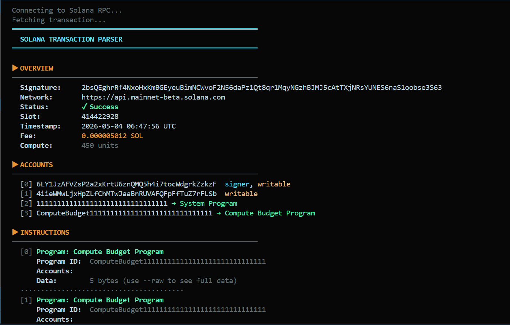
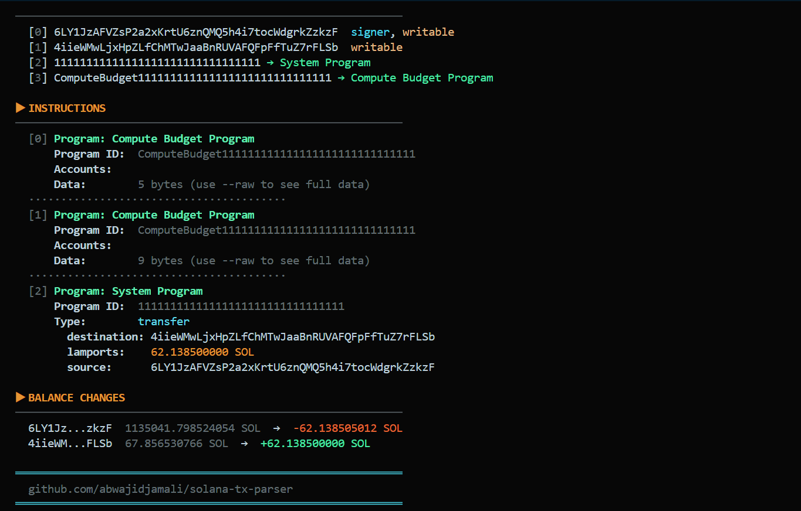

#  Solana Transaction Parser — Rust Terminal Tool

A terminal tool built in **Rust** that fetches and decodes raw Solana transactions via RPC by providing only transaction signature, no explorer needed. It works by passing any mainnet or devnet transaction signature and get a fully human-readable breakdown of accounts, instructions, programs called and balance changes.

---

## Demo




---

## Features

- **Transaction Overview:** Status, slot, timestamp, fee, compute units consumed.
- **Account Breakdown:** All accounts involved with signer & writable flags and program labels.
- **Instruction Decoding:** Fully parsed for System Program and SPL Token, partial decode for all others.
- **Balance Changes:** Exact SOL gained or lost per account, color-coded like green and red.
- **Known Program Labels:** 10+ major programs identified by name like Jupiter, Orca, Raydium, Metaplex, SPL Token.
- **`--raw` flag:** Expose raw base58 instruction data for deep inspection.
- **`--rpc` flag:** Switch between mainnet, devnet or any custom RPC endpoint.

---

## Install & Run

### Prerequisites
- [Rust](https://rustup.rs/) (1.18+)

### Clone and build
```bash
git clone git@github.com:abwajidjamali/solana-tx-parser.git
cd solana-tx-parser
cargo build --release
```

### Parse a transaction
```bash
# Mainnet
cargo run -- <TRANSACTION_SIGNATURE>

# Devnet
cargo run -- <TRANSACTION_SIGNATURE> --rpc https://api.devnet.solana.com

# Show raw instruction data
cargo run -- <TRANSACTION_SIGNATURE> --raw
```

---

## Example Output

```
════════════════════════════════════════════════════════════
  SOLANA TRANSACTION PARSER
════════════════════════════════════════════════════════════

▶ OVERVIEW
────────────────────────────────────────────────────────────
  Signature:     5UfDuX3Y...
  Network:       https://api.mainnet-beta.solana.com
  Status:        ✓ Success
  Slot:          271,832,194
  Timestamp:     2024-04-18 10:32:11 UTC
  Fee:           0.000005000 SOL
  Compute:       450 units

▶ ACCOUNTS
────────────────────────────────────────────────────────────
  [0] 9xQtMHa...  signer, writable
  [1] 7kPmZr3...  writable
  [2] 11111111111111111111111111111111 → System Program

▶ INSTRUCTIONS
────────────────────────────────────────────────────────────
  [0] Program: System Program
      Program ID:  11111111111111111111111111111111
      Type:        transfer
        source:    9xQtMHa...
        dest:      7kPmZr3...
        lamports:  0.500000000 SOL

▶ BALANCE CHANGES
────────────────────────────────────────────────────────────
  9xQtMH...  10.000000000 SOL  →  -0.500005000 SOL
  7kPmZr...   0.000000000 SOL  →  +0.500000000 SOL
════════════════════════════════════════════════════════════
```

---

## Real Signatures to Test With

These are real mainnet transactions that can be tested right now:

```bash
# Simple SOL transfer
cargo run -- 5wPxgXmtBHnSfRaUBMQQFkGbBRnDqVdpUkDPMJmrRNuUJi7KD3gGJpN3RN7mEdD1Ni2FSmJaovW9XyEmE52rTqC

# SPL Token transfer
cargo run -- 3JTCK6bVBFqsqjaGPqB3EBqGd6enSaLCGUvzSGBFQfJPAbdGGcFmXjHSbNQVGUoBmF5emAjFGQtgBnCuGtXDtgL

# Jupiter swap
cargo run -- 2CdTDMTHeTKyTaVQJyUMBtHoNSAfPrNFNLtDeEKgFWJr3JXdCHvbFuPELbDamNhMGSM7djuTPVLhHHuYXNfxFbE
```

---

## Known Programs

| Program ID | Label |
|---|---|
| `11111...` | System Program |
| `TokenkegQ...` | SPL Token Program |
| `ATokenGPv...` | Associated Token Program |
| `metaqbxx...` | Metaplex Token Metadata |
| `JUP6Lkb...` | Jupiter Aggregator v6 |
| `whirLbMi...` | Orca Whirlpool |
| `RVKd61z...` | Raydium Swap |
| `ComputeBudget...` | Compute Budget Program |

---

